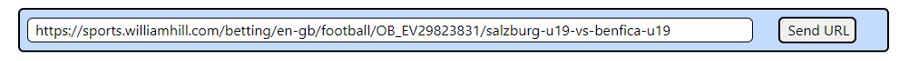

# Web Scraping - Proof of concept

## Football Odds Web Scraper

As I started on my Web Development journey, I wanted to push myself to learn concepts outside of the course I was attending.  As part of that 'pushing' myself I thought it would be interesting to learn how to use Web Scraping and applied that learning to create this site.  This was 4 weeks into my learning.

  

## Contents

* [Introduction](#My-First-Project)
* [Libraries and Techniques](#Libraries-and-Techniques)
* [Design (UXD)](#Design)
    * [Scope](#Scope)
    * [Structure](#structure)
* [Instructions](#Instructions)
* [Future Feature Enhancements](#Future-Feature-Enhancements)
* [Known outstanding bugs](#Known-outstanding-bugs)
* [Contributors](#Contributors)

## Libraries and Techniques

* HTML - for the Web Pages
* JavaScript for the data manipulation and the backend API calls
* [BootStrap](https://getbootstrap.com/) - to assist with the visuals.  I found this gave me greater control over the style and layout of the pages
* [Express js](https://expressjs.com/) - for running the Web Server
* [Puppeteer](https://pptr.dev/) - for the Web Scraping
* [Cheerio](https://www.npmjs.com/package/cheerio) - to load HMTL content received from the Web Scraping
* [Notifier](https://www.npmjs.com/package/node-notifier) - to provide screen popup notifications

## Design

### Scope

The scope of the project was to learn how Web Scraping works and to put it to use.  For that I decided to use sports betting as that provided me with values that were changing frequently, which meant I would be able to show the Web Scraping happenning in real time.  

I then added 'Notifier' to provide a visual alert when the values being scraped changed.

### Structure

Due to the nature of the App I only needed the 1 page.

* Input bar to add the URL of the Football match to be scraped
* Button to begin the Web Scrape
* Home and Away:-
    * Team name
    * Current odds
    * Buttons for higher or lower odds notifications
* User instructions

## Instructions

The code is based on running against a [William Hill](https://sports.williamhill.com/betting/en-gb/in-play/all) in=play footbal match.

The user needs to copy the url of the match into the input bar and click the 'Send URL' button.

  

The Web Scraper will then go to that URL and pull back the data to populate the details of:-
*   Team names
*   Current odds

      

The user can select either of the higher or lower buttons and receive a screen pop up when the corresponding teams odds have changed as per the direcction which was chosen. 

The program will run continuously until the match ends, so no need for the user to keep refreshing the screen.

## Future Feature Enhancements

1. I was unable to scrape the score and the time from the game - this would be good to have and would provide a better user experience

## Known outstanding bugs

There are no known bugs at this time

